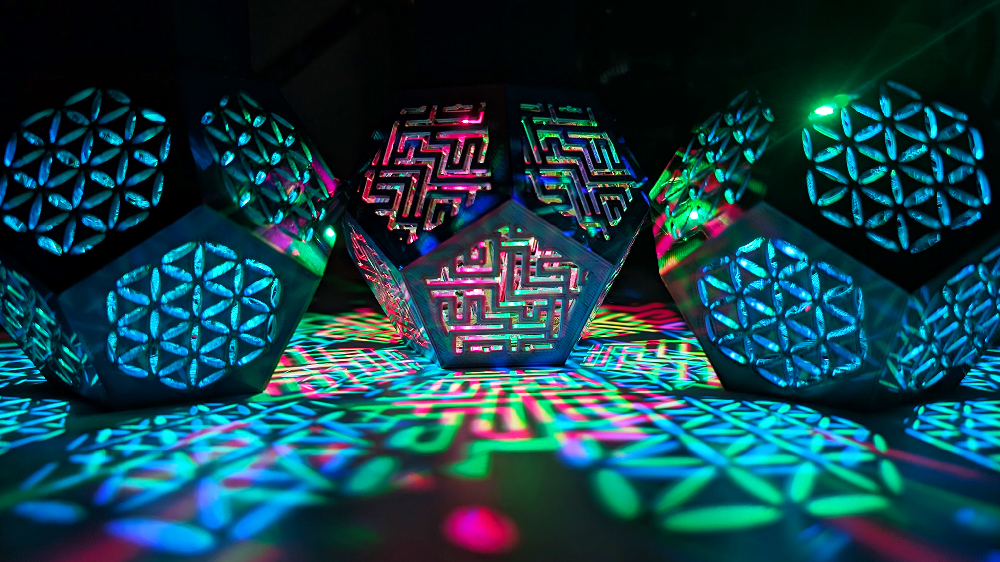

# 🏮 Geometry Projecting Lantern

A 3D printed geometric lantern that uses an Arduino to project patterns through its sides.

🎥 **Watch the build video:**  

---

## 📷 Preview

---

## 📁 Files Included

- `itsmakingthings_Geometry_Lantern_Sketch.zip` – Arduino sketch
- `README.md` – This file
- `LICENSE` – Unlicense license

---

## 🔧 Hardware Required

- 📦 [All STLs on Printables](https://www.printables.com/model/1224254-geometry-projecting-lantern)

**Parts List:**

- 🔌 [Digispark Microcontroller](https://amzn.to/4kFAPAc)  
- 💡 [WS2812B Addressable LEDs](https://amzn.to/41FyRqU)  
- 🔋 [3.7V LiPo Battery](https://amzn.to/41Tcwr9)  
- 🔌 [3.7V LiPo Charger](https://amzn.to/3Fd35Kk)  
- ⚡ [Step-Up Converter](https://amzn.to/41FxvMQ)  
- 🎨 [Matte Filament](https://amzn.to/4ifgCzD)  
- ✨ [Silk Filament](https://amzn.to/3DEjtmD)  
- 🧯 [330 Ohm Resistors](https://amzn.to/3XDQbLM)  
- 🔘 [Switches](https://amzn.to/3FfM2aB)  
- 🔩 [Screws](https://amzn.to/4ih2ea2)  
- 🧵 [Cable](https://amzn.to/3DElTBJ)  
- 🖨️ [PEY Print Plate](https://amzn.to/4kFDcTC)

---

## 🚀 How to Use

1. 3D print the lantern parts (STLs linked in the video)
2. Extract and upload the Arduino sketch to your board
3. Assemble LEDs inside the lantern
4. Power it up to see geometric light projections

---

## 🧠 Credits

Created by [@itsmakingthings](https://www.youtube.com/@itsmakingthings)  
Feel free to remix or build on this. Share your versions!

---

## 🔗 Links

- 🔧 [3D Print Files – in video description](https://youtu.be/bjrkqY3MxlQ?si=e1oNodO5uuMQtuSq)
- 🧠 [Learn more on my YouTube channel](https://www.youtube.com/@itsmakingthings)

---

## 📜 License

This project is licensed under the **Creative Commons Attribution-NonCommercial 4.0 International (CC BY-NC 4.0)** license.

You are free to:

- **Share** – copy and redistribute the material in any medium or format  
- **Adapt** – remix, transform, and build upon the material  

Under the following terms:

- **Attribution** – You must give appropriate credit and link to the original source  
- **NonCommercial** – You may not use the material for commercial purposes  

🔗 [View full license](https://creativecommons.org/licenses/by-nc/4.0/)

Here's the code:

#include <Adafruit_NeoPixel.h>

#define PIN 4               // Data pin for the LEDs
#define NUM_LEDS 2          // Number of LEDs
#define MAX_BRIGHTNESS 255  // Max brightness

Adafruit_NeoPixel strip = Adafruit_NeoPixel(NUM_LEDS, PIN, NEO_GRB + NEO_KHZ800);

// How to control the LEDs:
// ###  Speed       --> If one LED is speed = 50 and the other is 62, it will sync after 5 cycles (lower numbers are faster)
// ###  Color       --> Red: 0, Yellow: 42, Green: 85, Cyan: 127, Blue: 170, Magenta: 212
// ###  Direction   --> 1 for forward (color never cyncs), -1 for backward (colors do sync)

// Different color patterns - uncomment the one you want, and comment out the rest:

// ##### Pattern 1 ##### Lots of variety, lots of color syncing
int speed1 = 50;
int speed2 = 110;
int colorIndex1 = 127; // Starting color for LED 1 (Cyan)
int colorIndex2 = 212; // Starting color for LED 2 (Magenta)
int direction1 = 1; // Forward
int direction2 = -1; // Backward

/*
// ##### Pattern 2 ##### Very simple, 2 colors sync often - calming
int speed1 = 50;
int speed2 = 50;
int colorIndex1 = 127; // Starting color for LED 1 (Cyan)
int colorIndex2 = 127; // Starting color for LED 2 (Cyan)
int direction1 = 1; // Forward
int direction2 = -1; // Backward
*/

/*
// ##### Pattern 3 ##### Complementary colors following - more like 'Pop Art'
int speed1 = 60;
int speed2 = 60;
int colorIndex1 = 42; // Starting color for LED 1 (Yellow)
int colorIndex2 = 170; // Starting color for LED 2 (Blue)
int direction1 = 1; // Forward
int direction2 = 1; // Forward
*/

/*
// ##### Pattern 4 ##### Close colors following, little contrast, 'global' light cycles spectrum
int speed1 = 60;
int speed2 = 60;
int colorIndex1 = 170; // Starting color for LED 1 (Blue)
int colorIndex2 = 212; // Starting color for LED 2 (Magenta)
int direction1 = 1; // Forward
int direction2 = 1; // Forward
*/

/*
// ##### Pattern 5 ##### Strong contrast following - more 'unstable' color combinations
int speed1 = 60;
int speed2 = 60;
int colorIndex1 = 85; // Starting color for LED 1 (Green)
int colorIndex2 = 170; // Starting color for LED 2 (Blue)
int direction1 = 1; // Forward
int direction2 = 1; // Forward
*/

// Code to control the LEDs
void setup() {
  strip.begin();
  strip.setBrightness(MAX_BRIGHTNESS);
  strip.show();
}

void loop() {
  cycleColors();
}

void cycleColors() {
  static unsigned long lastUpdate1 = 0;
  static unsigned long lastUpdate2 = 0;
  unsigned long now = millis();

  if (now - lastUpdate1 > speed1) {
    strip.setPixelColor(0, Wheel(colorIndex1)); // Update LED 1
    colorIndex1 = (colorIndex1 + direction1 + 256) % 256; // Ensure colorIndex wraps around properly
    lastUpdate1 = now;
  }

  if (now - lastUpdate2 > speed2) {
    strip.setPixelColor(1, Wheel(colorIndex2)); // Update LED 2
    colorIndex2 = (colorIndex2 + direction2 + 256) % 256; // Ensure colorIndex wraps around properly
    lastUpdate2 = now;
  }

  strip.show();
}

// Input a value 0 to 255 to get a color value.
// The colors are a transition r - g - b - back to r.
uint32_t Wheel(byte WheelPos) {
  WheelPos = 255 - WheelPos;
  if (WheelPos < 85) {
    return strip.Color(255 - WheelPos * 3, 0, WheelPos * 3);
  } else if (WheelPos < 170) {
    WheelPos -= 85;
    return strip.Color(0, WheelPos * 3, 255 - WheelPos * 3);
  } else {
    WheelPos -= 170;
    return strip.Color(WheelPos * 3, 255 - WheelPos * 3, 0);
  }
}
